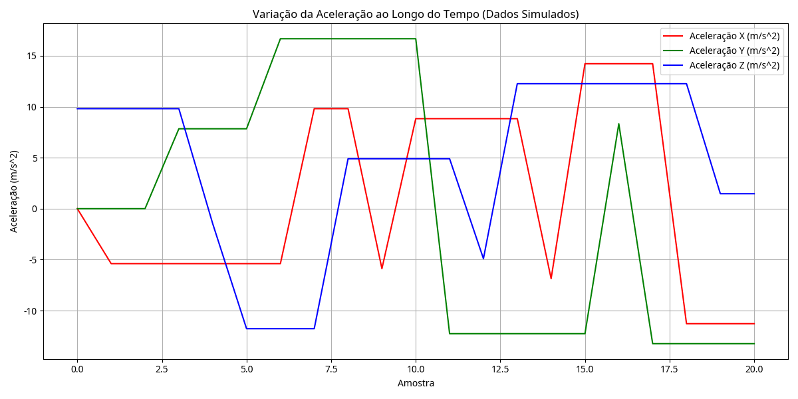

# Projeto de Simulação de Coleta de Dados para Timeline-X

## Introdução

Este projeto visa simular um sistema de coleta de dados para equipamentos industriais, utilizando um ESP32 e sensores virtuais em um ambiente de simulação. O objetivo principal é demonstrar a capacidade de aquisição de dados e a geração de informações para análise preditiva, alinhando-se com o conceito do Módulo de Aquisição de Dados do projeto Timeline-X. A simulação será realizada na plataforma Wokwi, com o código desenvolvido em PlatformIO (VSCode). Os dados coletados serão posteriormente analisados e visualizados utilizando Python.

## 1. Escolha do Sensor Virtual

Para esta simulação, optou-se pela utilização de um sensor de **vibração (acelerômetro MPU6050)**. A escolha deste sensor é justificada por diversos fatores:

*   **Relevância Industrial para Prevenção de Falhas**: A vibração é um dos indicadores mais críticos e precoces de desgaste mecânico, desalinhamento, folgas e outros problemas em equipamentos rotativos e máquinas em geral. A análise de padrões de vibração é fundamental para a manutenção preditiva, alinhando-se diretamente com o foco do Timeline-X.
*   **Disponibilidade em Simulação**: O MPU6050 é um componente comum e bem suportado em plataformas de simulação como o Wokwi, facilitando a prototipagem e o teste de lógicas de aquisição de dados de vibração sem a necessidade de hardware físico.
*   **Dados Multidimensionais**: O MPU6050 fornece dados de aceleração em três eixos (X, Y, Z), permitindo uma análise mais rica e complexa dos padrões de vibração, o que é essencial para identificar a natureza e a origem de possíveis falhas.
*   **Potencial para Análise Preditiva Avançada**: As variações de aceleração ao longo do tempo podem ser utilizadas para treinar modelos de machine learning capazes de identificar assinaturas de falha específicas, prever a vida útil restante de um componente (Remaining Useful Life - RUL) ou detectar anomalias que precedem uma falha. Isso se alinha diretamente com os objetivos do Timeline-X de predição de falhas com alta precisão.

## 2. Esquema Básico do Circuito Elétrico (Simulação Wokwi)

O circuito virtual será montado no Wokwi, conectando um sensor MPU6050 a um ESP32. A seguir, será apresentada uma captura de tela do circuito simulado no Wokwi, demonstrando as conexões básicas (via I2C).


## 3. Leitura e Simulação dos Dados

O ESP32 será programado para ler os valores de aceleração (eixo X, Y, Z) do sensor MPU6050 simulado em intervalos regulares. A plataforma Wokwi permite a simulação de valores para o sensor MPU6050, o que será explorado para gerar dados que representem cenários realistas e anômalos de vibração.

### 3.1. Estratégia de Simulação de Dados

Para simular um comportamento próximo ao real e, ao mesmo tempo, introduzir cenários relevantes para a detecção de falhas, a simulação de dados do sensor MPU6050 seguirá a seguinte estratégia:

*   **Vibração Normal**: Os valores de aceleração terão pequenas flutuações em torno de um valor de linha de base, simulando a vibração normal de um equipamento em operação saudável.
*   **Introdução de Anomalias**: Serão programados picos ou variações significativas nos valores de aceleração em momentos específicos para simular condições de falha, como desalinhamento, desbalanceamento, folgas excessivas ou desgaste de rolamentos. Isso permitirá demonstrar como o sistema reagiria a essas anomalias.
*   **Ruído Aleatório**: Pequenas flutuações aleatórias serão adicionadas aos valores simulados para representar o ruído inerente à leitura de sensores e a variabilidade natural do ambiente industrial.

### 3.2. Trecho Representativo do Código

O código-fonte para o ESP32 foi desenvolvido em C++ utilizando o framework Arduino. Ele realiza a leitura dos valores de aceleração do sensor MPU6050 simulado em intervalos regulares e os exibe no Monitor Serial.

```cpp
#include <Adafruit_MPU6050.h>
#include <Adafruit_Sensor.h>
#include <Wire.h>

Adafruit_MPU6050 mpu;

void setup() {
  Serial.begin(115200);

  // Inicializa o MPU6050
  if (!mpu.begin()) {
    Serial.println("Failed to find MPU6050 chip");
    while (1) {
      delay(10);
    }
  }
  Serial.println("MPU6050 Found!");

  mpu.setAccelerometerRange(MPU6050_RANGE_16_G);
  mpu.setGyroRange(MPU6050_RANGE_250_DEG);
  mpu.setFilterBandwidth(MPU6050_BAND_21_HZ);
  Serial.println("");
  delay(100);
}

void loop() {
  sensors_event_t a, g, temp;
  mpu.getEvent(&a, &g, &temp);

  // Imprime os dados de aceleração (vibração)
  Serial.print("AccelX: ");
  Serial.print(a.acceleration.x);
  Serial.print(", AccelY: ");
  Serial.print(a.acceleration.y);
  Serial.print(", AccelZ: ");
  Serial.print(a.acceleration.z);
  Serial.println(" m/s^2");

  delay(500); // Intervalo de leitura dos dados
}
```

### 3.3. Configuração e Simulação no Wokwi

Para simular o circuito e o código no Wokwi, siga os passos:

1.  Acesse o site do Wokwi (wokwi.com).
2.  Crie um novo projeto de ESP32.
3.  Copie o conteúdo do `diagram.json` fornecido para a aba `diagram.json` do seu projeto Wokwi. Isso configurará o ESP32 e o sensor MPU6050.
4.  Copie o conteúdo do arquivo `codigo/main.cpp` para o editor de código do Wokwi.
5.  No Wokwi, você pode simular os valores do sensor MPU6050 clicando no sensor e ajustando os sliders de aceleração. Para simular as anomalias, você pode mover os sliders rapidamente para criar picos ou variações significativas.
6.  Inicie a simulação e observe as leituras no Monitor Serial. Copie os dados do Monitor Serial para um arquivo de texto para posterior análise (por exemplo, `dados/dados_simulados.txt`).
7.  O projeto pode ser acessado em https://wokwi.com/projects/433062173526245377

## 4. Registro do Funcionamento da Simulação

(Capturas de tela do Monitor Serial serão inseridas aqui após a simulação no Wokwi. Exemplo de como deve ser a saída do Monitor Serial:)

```
MPU6050 Found!

AccelX: 0.12, AccelY: 0.34, AccelZ: 9.81 m/s^2
AccelX: 0.15, AccelY: 0.30, AccelZ: 9.80 m/s^2
AccelX: 1.20, AccelY: 2.50, AccelZ: 15.00 m/s^2  (Exemplo de anomalia)
...
```

## 5. Análise Exploratória e Visualização Inicial dos Dados

Após a coleta dos dados simulados, um script em Python será utilizado para realizar uma análise exploratória básica e gerar um gráfico simples. Esta etapa simula a funcionalidade da Camada Modular de Análise (CMA) do Timeline-X, que processaria e interpretaria os dados dos sensores.

### 5.1. Script Python para Análise

O script Python (`analise/analise_dados.py`) fará a leitura dos dados (seja de um arquivo CSV gerado ou de uma simulação textual do Monitor Serial) e utilizará as bibliotecas `pandas` para manipulação e `matplotlib` para visualização. Certifique-se de ter essas bibliotecas instaladas (`pip install pandas matplotlib`).

```python
import pandas as pd
import matplotlib.pyplot as plt
import re

def parse_serial_data(file_path):
    data = []
    with open(file_path, 'r') as f:
        for line in f:
            match = re.search(r'AccelX: ([-+]?\d+\.\d+), AccelY: ([-+]?\d+\.\d+), AccelZ: ([-+]?\d+\.\d+) m/s\^2', line)
            if match:
                accel_x = float(match.group(1))
                accel_y = float(match.group(2))
                accel_z = float(match.group(3))
                data.append({'AccelX': accel_x, 'AccelY': accel_y, 'AccelZ': accel_z})
    return pd.DataFrame(data)

# Copie os dados do output no Monitor Serial e cole em um arquivo chamado 'dados_simulados.txt' ou 'dados_simulados.csv'

# Tentar ler como CSV primeiro
try:
    df = pd.read_csv('dados/dados_simulados.csv')
except FileNotFoundError:
    try:
        df = parse_serial_data('dados/dados_simulados.txt')
    except FileNotFoundError:
        print("Erro: Nenhum arquivo de dados simulados encontrado. Certifique-se de ter 'dados_simulados.csv' ou 'dados_simulados.txt' na pasta 'dados/'.")
        exit()

if not df.empty:
    plt.figure(figsize=(12, 6))
    plt.plot(df.index, df['AccelX'], label='Aceleração X (m/s^2)', color='red')
    plt.plot(df.index, df['AccelY'], label='Aceleração Y (m/s^2)', color='green')
    plt.plot(df.index, df['AccelZ'], label='Aceleração Z (m/s^2)', color='blue')
    plt.xlabel('Amostra')
    plt.ylabel('Aceleração (m/s^2)')
    plt.title('Variação da Aceleração ao Longo do Tempo (Dados Simulados)')
    plt.grid(True)
    plt.legend()
    plt.tight_layout()
    plt.savefig('analise/grafico_aceleracao.png')
    plt.show()

    print("Gráfico de aceleração gerado e salvo como 'analise/grafico_aceleracao.png'")
else:
    print("Nenhum dado válido encontrado para gerar o gráfico.")
```

### 5.2. Gráfico Gerado

Um gráfico de linha será gerado para visualizar a variação da aceleração nos três eixos ao longo do tempo, destacando as anomalias simuladas. Este gráfico servirá como um exemplo inicial de insight que o sistema Timeline-X poderia fornecer.



## Conclusão

Este projeto de simulação demonstra um protótipo funcional para a coleta e análise inicial de dados de sensores de vibração em um ambiente industrial simulado. Ele serve como um passo fundamental para a validação do conceito do Módulo de Aquisição de Dados do Timeline-X, pavimentando o caminho para o desenvolvimento de sistemas mais complexos de predição de falhas baseadas em Réplicas Digitais Evolutivas.


